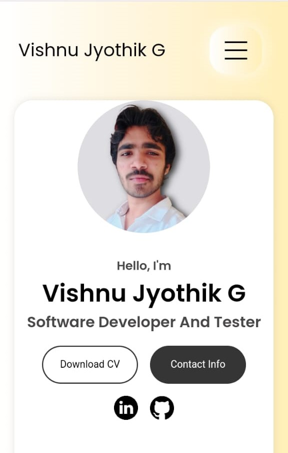

# Vishnu Jyothik's Portfolio

Welcome to my personal portfolio! Explore my skills, projects, and get in touch with me.

## Table of Contents
- [About Me](#about)
- [Experience](#experience)
- [Projects](#projects)
- [Contact Me](#contact)
- [Project Structure](#project-structure)
- [License](#license)

## About Me
I am Vishnu Jyothik G, a passionate software developer and tester. Learn more about my background, education, and skills.

- **Role:** Software Developer And Tester
- **Education:** BCA Bachelors Degree
- **LinkedIn:** [Connect with me](https://www.linkedin.com/in/vishnu-jyothik-g/)
- **GitHub:** [Check out my projects](https://github.com/vishnutth)

## Experience
Explore my experience in frontend, blockchain development, and software testing.

### Frontend And Blockchain Development
- HTML: Intermediate
- CSS: Basic
- JavaScript: Intermediate
- React.js: Basic
- Blockchain: Basic
- Solidity: Intermediate

### Software Testing
- Manual Testing: Basic
- Java with Selenium: Intermediate
- Jira and Jenkins: Intermediate
- Git And GitHub: Intermediate

## Projects
Browse through my recent projects and check out the live demos on GitHub.

### Personnel Web Portfolio

- **GitHub:** [Repository](https://github.com/vishnutth/Personnel-Portfolio--Vishnu-jyothik-)
- **Live Demo:** [View Demo](https://shiny-fairy-98a519.netlify.app/)

### Project Two

- **GitHub:** [Repository](https://github.com/vishnutth)
- **Live Demo:** [Not available]

### Project Three

- **GitHub:** [Repository](https://github.com/vishnutth)
- **Live Demo:** [Not available]

## Contact Me
Get in touch with me through the following channels:

- **Email:** [vishnutth@gmail.com](mailto:vishnutth@gmail.com)
- **LinkedIn:** [Connect with me](https://www.linkedin.com/in/vishnu-jyothik-g)
- **GitHub:** [Check out my projects](https://github.com/vishnutth)
- **Instagram:** [Follow me](https://www.instagram.com/vishnutth/)
- **Twitter:** [Follow me](https://twitter.com/Vishnu385275255)
- **Replit:** [Explore my Replit](https://replit.com/@vishnutth)
- **WhatsApp:** [Chat with me](https://wa.me/9620935877/)

## Project Structure
This project includes the following key files and directories:

- **index.html:** The main HTML file that structures the content of the portfolio.
- **style.css:** The CSS file containing styles for the portfolio layout and design.
- **mediaqueries.css:** Additional CSS file containing media queries for responsive design.
- **script.js:** JavaScript file that adds interactivity to the portfolio.
- **assets:** Directory containing images and icons used in the portfolio.
  - **email.png:** Email icon.
  - **linkedin.png:** LinkedIn icon.
  - **github.png:** GitHub icon.
  - **instagram.png:** Instagram icon.
  - **twitter.png:** Twitter icon.
  - **replit.png:** Replit icon.
  - **watsapp.png:** WhatsApp icon.
  - **project-1.jpg:** Image for Project One.
  - **project-2.png:** Image for Project Two.
  - **project-3.png:** Image for Project Three.
  - **profile-pic.png:** Profile picture.

Feel free to explore and modify these files to customize your portfolio.

## License
This portfolio is licensed under the [MIT License](LICENSE).

---

**Copyright © 2023 Vishnu Jyothik. All Rights Reserved.**
